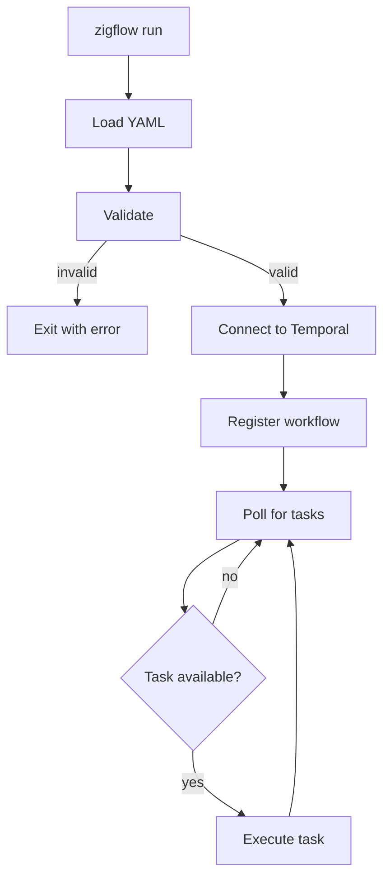

# How Zigflow Runs

## What you will learn

- What happens step by step when you run `zigflow run`
- How YAML is validated and built into an execution tree
- How Temporal workers are involved
- What the worker does during a workflow execution

---

## Step by step

When you run:

```sh
zigflow run -f workflow.yaml
```

The following happens in order:

### 1. Load the YAML

Zigflow reads the file at the path given by `-f`. The file must be valid YAML
or JSON.

### 2. Validate

Zigflow validates the definition against the schema. This happens before any
connection to Temporal is made.

Validation checks:

- Required fields are present (`document.dsl`, `document.taskQueue`,
  `document.workflowType`, `document.version`, `do`)
- All task types are recognised
- Input schema is valid JSON Schema, if provided
- All output and export expressions are syntactically correct

If validation fails, Zigflow prints the error and exits with a non-zero code.
No connection to Temporal is attempted.

You can also run validation without starting the worker:

```sh
zigflow validate workflow.yaml
```

### 3. Connect to Temporal

Zigflow connects to the Temporal server at the address given by
`--temporal-address` (default `localhost:7233`).

### 4. Build and register the workflow

Zigflow builds the validated task structure into a deterministic tree of Go
closures. It registers the resulting workflow types and activities on the task
queue specified by `document.taskQueue`. The closure tree is an in-memory
execution structure, not generated source code or a deployable workflow
artefact.

### 5. Start polling

The worker enters a poll loop. It asks Temporal: "is there any work on the
`<taskQueue>` task queue?"

The worker continues polling until it is interrupted (for example, with
`Ctrl+C`).

### 6. Execute a workflow

When a client starts a workflow execution, Temporal places a task on the
queue. The Zigflow worker picks it up and begins execution.

Execution is driven by Temporal's event history. Zigflow walks the closure
tree and interprets each task against the current workflow state. Tasks in your
`do` list run in sequence. Each Temporal command and result is recorded in the
history.

If the worker crashes and restarts, Temporal replays the history. Zigflow
re-executes each task from the top, but tasks whose results are already in
the history return their recorded values without re-running the underlying
logic.

---

## The worker model



## Dynamic workflow path

`zigflow run --dynamic-task-queue <queue>` installs an opt-in dynamic workflow
fallback. The workflow definition is supplied in the Temporal start input
instead of being read from a worker file. On each root execution, Zigflow
validates the recorded definition, builds an execution-local closure tree and
interprets it through the same task implementations as the static path.

See [Dynamic workflows](/docs/concepts/dynamic-workflows) for the versioned
input contract, snapshot timing and deployment constraints.

---

## What the worker exposes

While running, the Zigflow worker exposes HTTP endpoints on two ports:

| Endpoint | Port | Purpose |
| --- | --- | --- |
| `/livez` | `3000` | Liveness probe |
| `/readyz` | `3000` | Readiness probe |
| `/health` | `3000` | Backwards-compatible alias for `/readyz` |
| (Prometheus metrics) | `9090` | Runtime metrics |

These ports can be changed with `--health-listen-address` and
`--metrics-listen-address`.

---

## Determinism and replay

:::tip
For runtime expression syntax and built-in variable reference, see
[Data and expressions](/docs/concepts/data-and-expressions).
:::

Temporal replays workflows by replaying their event history. This means every
line of workflow code may run multiple times.

Zigflow enforces determinism by:

- Wrapping generated values (such as UUIDs) in Temporal side-effects via the
  `set` task, so generated values are stable across replays
- Running activities (HTTP calls, shell commands, external calls) outside the
  deterministic workflow context
- Rejecting constructs that would introduce non-determinism at validation time

The `set` task is the safe place for generated values.

---

## Common mistakes

**Running `zigflow run` with an invalid workflow and expecting it to start.**
Validation runs before the worker starts. A validation failure exits
immediately. Fix the validation error before retrying.

**Stopping the worker mid-execution.**
Temporal will continue to hold the workflow execution in its history. When
you restart the worker, Temporal replays the history and resumes from where
it left off.

**Editing a static workflow YAML while the worker is running.**
Zigflow loads a static YAML file once at startup. Changes to the file after the
worker starts have no effect until the worker is restarted. A dynamic
definition is recorded in its Temporal start input and does not change during
that execution.

---

## Related pages

- [Overview](/docs/concepts/overview): mental model summary
- [Temporal prerequisites](/docs/concepts/temporal-prereqs): core Temporal concepts
- [Set task](/docs/dsl/tasks/set): deterministic data generation
- [zigflow run](/docs/cli/commands/zigflow_run): full CLI reference
