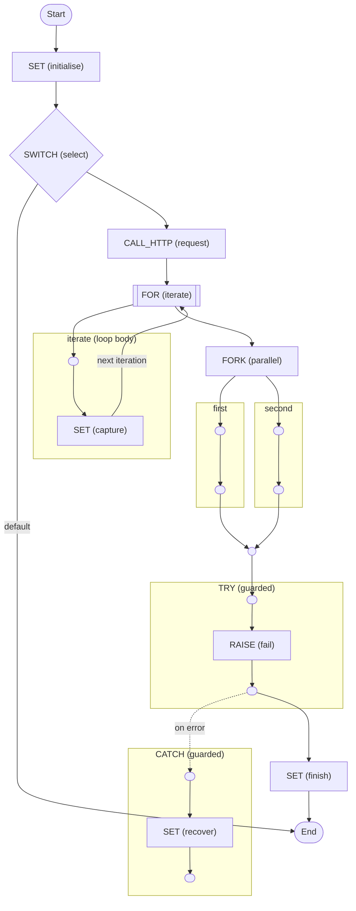

# Dynamic Workflow Execution

Exercise the opt-in dynamic workflow path against a real Temporal server.

<!-- toc -->

* [Run the E2E fixture](#run-the-e2e-fixture)
* [What this proves](#what-this-proves)
* [Diagram](#diagram)

<!-- Regenerate with "pre-commit run -a markdown-toc" -->

<!-- tocstop -->

## Run the E2E fixture

From the repository root, run:

```sh
task e2e
```

The fixture starts Zigflow with `--dynamic-task-queue dynamic-e2e` and no
workflow file. The test replaces the placeholder HTTP endpoint in
[`workflow.yaml`](./workflow.yaml) with a local recorder before starting the
execution.

## What this proves

The E2E test starts an arbitrary workflow type with a versioned inline
definition, exercises Set, Switch, HTTP, For, Fork, Try and Continue-As-New,
then replays the completed histories. It also proves that invalid input fails
before the HTTP endpoint is called and that replay uses the definition and
environment recorded at execution start.

See the
[dynamic workflow documentation](https://zigflow.dev/docs/concepts/dynamic-workflows)
for the public input envelope and a manual starter payload.

## Diagram

<!-- ZIGFLOW_GRAPH_START -->

<!-- ZIGFLOW_GRAPH_END -->
